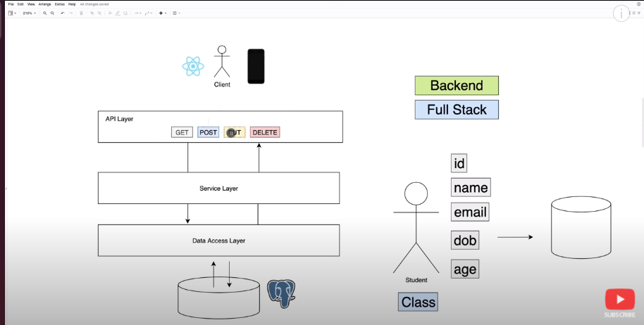

[Tutorial Link](https://www.youtube.com/watch?v=9SGDpanrc8U
)

API Layer --> Controller class \
Service Layer --> Service class for businesses logic \
Data access layer --> using repository interface that extends JpaRepository interface \
Database using mysql and its configuration is in application.properties file

- GET - to fetch data
- POST - to add data 
- PUT - to update existing data
- DELETE - to delete data

to run application
go to target folder and execute below command
this will run on default server configuration
- java -jar SpringBootDemo_Youtube-0.0.1-SNAPSHOT.jar

to Run on different port add --server.port=port_number
ex 
- java -jar SpringBootDemo_Youtube-0.0.1-SNAPSHOT.jar --server.port=8081
